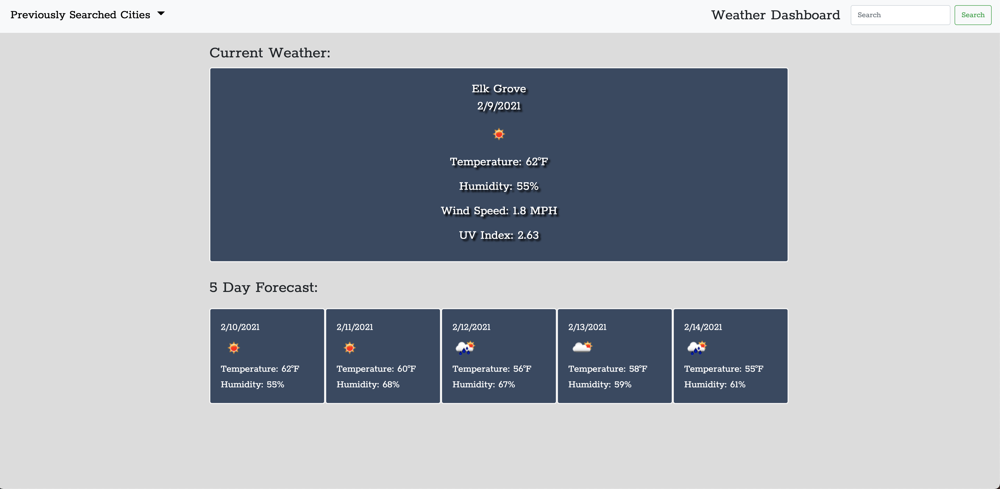

# Weather Dashboard

* This is a weather dashboard that will present the user with the the current weather as well as a 5 day forecast of searched city.

* Uses openweather API

* Under previously searched cities the user will have an access to the list all the previous seatches.

* When a city from the list is clicked the weather data for that area will be displayed.

* users last search is stored and will load in dashboard when application is opened.

This is the [link](https://cjserame24.github.io/Weather-Dashboard/) to the website.
 

